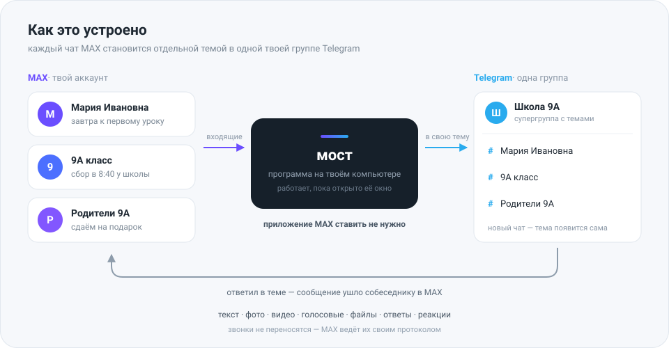

# max-tg-bridge

[](https://github.com/dimaad5017-dotcom/max-tg-bridge/actions/workflows/check.yml)
[](LICENSE)
[](https://www.python.org/downloads/)

Мост между **MAX** и **Telegram**. Программа заходит в твой аккаунт MAX как ещё
одно устройство и перекладывает переписку в Telegram: каждый чат MAX становится
отдельной темой в твоей супергруппе. Пишешь в теме — сообщение уходит
собеседнику в MAX. Приложение MAX при этом не нужно ни на телефоне, ни на
компьютере.

<p align="center">
  
</p>

Зачем это вообще: школа, работа или знакомые сидят в MAX, а ты не хочешь ставить
себе ещё один мессенджер. Мост оставляет тебя в Telegram, но не отрезает от
переписки. Заодно телефон остаётся чистым — почему это главное, разобрано ниже,
в [«Приватность, безопасность, оговорки»](#приватность-безопасность-оговорки).

**Сразу о цене вопроса.** Приложение MAX ставить не придётся, а вот включённый
компьютер — понадобится: мост это программа, и работать она должна в тот момент,
когда приходит сообщение. Подойдёт домашний компьютер или [VPS](docs/vps.md). На
самом телефоне мост не живёт, а на айфоне это невозможно в принципе — iOS не даёт
программам работать в фоне. Но выключенный мост ничего не теряет: сообщения
копятся в MAX и приезжают при следующем запуске, просто с задержкой.

> **Разделы ниже раскрываются по клику** — страница короткая, но внутри всё.
> Нужно просто запустить у себя: [«Как поставить себе»](#как-поставить-себе),
> там по порядку. Что-то сломалось — [разбор неполадок](docs/troubleshooting.md),
> в нём каждая известная ошибка.

Отдельными файлами: [Mac и Linux](docs/mac-linux.md) · [VPS](docs/vps.md) ·
[что могло пойти не так](docs/troubleshooting.md) ·
[что где лежит](docs/files.md) ·
[перенос на другой компьютер](docs/moving.md)

---

## Что мост умеет и чего не умеет

| Что                                 | MAX → Telegram | Telegram → MAX |
| ----------------------------------- | -------------- | -------------- |
| Текст                               | да             | да             |
| Фото                                | да             | да             |
| Видео                               | да             | да             |
| Голосовые                           | да             | да, файлом     |
| Видеокружок                         | —              | да, кружком    |
| Файлы и документы                   | да             | да             |
| Стикеры                             | да             | да, картинкой  |
| Ссылки с превью                     | да             | да             |
| Контакты                            | строкой        | нет            |
| Ответ на конкретное сообщение       | да             | да             |
| Реакции                             | да             | да             |
| «Печатает…»                         | да             | —              |
| Прочитано собеседником              | да (реакцией)  | —              |
| «Был в сети» и профиль              | по `/status`   | —              |
| Правка сообщения                    | да             | да, текста     |
| Удаление сообщения                  | пометкой       | да, 💩 или `/del` |
| Догон пропущенного за время простоя | да             | —              |
| «Тебя добавили в чат»               | да             | —              |
| Служебные события чата              | строкой        | —              |
| Факт звонка (кто, когда, сколько)   | строкой        | —              |
| Сам звонок и видеозвонок            | нет и не будет | нет и не будет |

<details>
<summary><b>Чего не будет — и почему именно</b></summary>

- **Звонков** — MAX передаёт их своим протоколом, в Telegram такое не переложить.
  Мост напишет в тему, что звонок был и сколько длился, но поговорить через него
  нельзя.
- **Анимированного стикера как анимации** — обычный стикер уезжает в MAX
  картинкой, «живой» — коротким видео, а формат `.tgs` не открывает никто, кроме
  самого Telegram, поэтому он честно уходит файлом.
- **Голосового в родном виде** — оно доезжает, но приходит файлом `voice.ogg`:
  открывается и слушается, просто без полоски со звуковой волной. Это не лень:
  MAX не подтверждает загрузку голосового вообще — библиотека ждёт минуту и
  сдаётся, и так на всех пяти проверенных форматах. Когда починят на той стороне —
  вернём.
- **Кружка с любого телефона** — MAX принимает кружки только в своём формате
  (480×480, 30 кадров в секунду). Твой телефон может писать иначе; тогда мост
  отправит ту же запись обычным видео, чтобы она не потерялась.
- **Опросов, геопозиции, кубиков** — если отправишь такое в тему, мост честно
  ответит «не отправлено» и назовёт формат, чтобы ты не думал, что оно ушло.
- **Файлов тяжелее 20 МБ из Telegram** — столько Telegram отдаёт ботам, это его
  ограничение, а не моста.
- **Файлов тяжелее 50 МБ из MAX** — столько бот вправе залить в Telegram.

</details>

Главный принцип: **мост никогда не молчит**. Если что-то не доехало — он пишет
в тему, что именно и почему, чтобы ты знал, что надо заглянуть в MAX.

---

## Как поставить себе

Понадобится:

1. **Номер телефона с работающим MAX** — своим, не чужим. На него придёт SMS.
2. **Компьютер или VPS, который может работать долго.** Телефон для этого не
   подойдёт. Чем дольше мост включён, тем ближе переписка к живой; выключенный
   ничего не теряет, но приносит всё разом и с задержкой.
3. **Telegram** — обычный аккаунт.
4. **Python 3.11 или новее** — ставится один раз, дальше про него можно забыть.

Интернет нужен и MAX, и Telegram. Если Telegram у тебя открывается только через
VPN — мосту он тоже понадобится.

<details>
<summary><b>Шаг 1. Бот и группа в Telegram</b> — делается один раз, одинаково везде</summary>

### 1.1. Создай бота

Напиши [@BotFather](https://t.me/BotFather), отправь `/newbot`. Он спросит
название и адрес бота (адрес должен заканчиваться на `bot`). В ответ придёт
**токен** — длинная строка вида `1234567890:AAE...`.

**Токен — это пароль от бота.** Никому его не показывай, не выкладывай в чат и
не оставляй на скриншотах. Если засветил — у @BotFather есть `/revoke`, старый
токен перестанет работать.

### 1.2. Выключи боту «режим приватности»

Там же у @BotFather: `/setprivacy` → выбери своего бота → **Disable**.

Без этого бот в группах видит только команды вроде `/help`, а обычный текст —
нет. То есть входящие будут приходить, а твои ответы уходить не будут.

Сделай это **до** того, как добавишь бота в группу. Если бот уже в группе — после
смены настройки удали его из группы и добавь заново, иначе не подействует.

### 1.3. Создай супергруппу с темами

В Telegram: **Новая группа** → название любое → участников можно не добавлять
(себя достаточно) → создать.

Потом зайди в настройки этой группы и включи **«Темы»** (Topics). Группа
автоматически станет супергруппой — так и надо.

Там же, в настройках группы, проверь **«Реакции»**: должны быть разрешены все.
Реакциями мост показывает прочитанное (👀) и по ним же понимает «стереть везде»
(💩) — с урезанным набором нужного значка может просто не оказаться в списке.

### 1.4. Сделай бота администратором

Добавь бота в группу (настройки группы → Участники → Добавить). Потом:
настройки → Администраторы → добавить бота.

Обязательно включи ему права:

- **Управление темами** — без этого мост не сможет создать тему под новый чат;
- **Отправка сообщений**;
- **Удаление сообщений** — без него не сработает 💩 «стереть везде».

Это самая частая причина, по которой «ничего не работает». Проверь дважды.

### 1.5. Узнай ID группы

Напиши в группу любое сообщение (например, `привет`). Затем открой в браузере,
подставив свой токен:

```
https://api.telegram.org/bot<ТВОЙ_ТОКЕН>/getUpdates
```

В ответе найди `"chat":{"id":-1001234567890`. Число с минусом — это и есть ID
группы. Он длинный и начинается на `-100`.

Если ответ пустой (`"result":[]`) — значит, бот сообщения не увидел: вернись к
пункту 1.2 про приватность, потом напиши в группу ещё раз.

</details>

<details>
<summary><b>Шаг 2. Установка на Windows</b> — всё двойными кликами, консоль не нужна</summary>

### Поставь Python

Скачай с [python.org/downloads](https://www.python.org/downloads/) и при
установке **обязательно поставь галочку «Add python.exe to PATH»** — она внизу
первого экрана и по умолчанию выключена. Если пропустишь, ничего не заработает
и придётся переустанавливать.

### Скачай мост

Кнопка **Code → Download ZIP** на странице проекта. Распакуй куда угодно,
например в `C:\max-tg-bridge`. Папку потом лучше не переносить.

### Поставь

Двойной клик по **`1-установить.cmd`**. Он проверит Python, создаст отдельное
окружение и поставит библиотеки. Займёт минуту. В конце должно быть написано
«Готово».

### Настройки

Двойной клик по **`2-настроить.cmd`** — откроется блокнот с файлом `.env`.
Заполни:

```
MAX_PHONE=+79991234567
MAX_NAME=Иван Петров
TG_BOT_TOKEN=1234567890:AAE...
TG_GROUP_ID=-1001234567890
TG_DELETE_MARK=
MAX_SHOW_ONLINE=
```

- `MAX_PHONE` — можно оставить пустым, тогда номер спросят при входе.
- `MAX_NAME` — нужно, **только** если аккаунта MAX на этом номере ещё нет: тогда
  он создастся с этим именем, и его увидят собеседники. Если аккаунт уже есть —
  поле не пригодится, старое имя останется нетронутым.
- `TG_BOT_TOKEN` и `TG_GROUP_ID` — из шага 1.
- `TG_DELETE_MARK` — значок, которым стирать сообщение везде. Пусто — значит 💩.
  Годится любая реакция, какую Telegram даёт поставить: `TG_DELETE_MARK=🖕`.
  Нельзя только 👀 — им мост отмечает прочитанное, и тогда прочитанное стиралось
  бы само; мост про это скажет и не запустится. Новый значок начинает работать
  после перезапуска, старый сразу перестаёт.
- `MAX_SHOW_ONLINE` — показывать ли собеседникам своё присутствие. Пусто — значит
  не показывать, и это правильный выбор: мост на связи круглые сутки, так что
  «да» здесь означает «всегда онлайн». Подробнее — в разделе
  [«Как пользоваться»](#как-пользоваться), там раскрывашка «Про «вечно в сети»».

Значение пишется сразу после `=`, без кавычек и без пробелов. Сохрани
(`Ctrl+S`) и закрой блокнот.

### Вход в MAX

Двойной клик по **`3-войти-в-MAX.cmd`**.

Скрипт запросит SMS-код. Введи его — сессия сохранится в `cache/max.db`, и больше
SMS не понадобится. Если на аккаунте включена двухфакторная защита,
дополнительно спросят пароль.

В конце скрипт напечатает список чатов, которые видит аккаунт. Увидел список —
вход прошёл.

### Запуск

Двойной клик по **`4-запустить-мост.cmd`**.

Пока окно открыто — мост работает. В группе появятся темы под каждый чат MAX.
Если мост упадёт, окно само поднимет его через 10 секунд. Чтобы выключить
совсем — закрой окно крестиком.

**Как понять, что он живой:** напиши в группе `/help`. Ответил — всё работает.
В окне при этом должны быть строки `Telegram на связи` и `MAX подключён`.

### Автозапуск вместе с Windows (по желанию)

Нажми `Win+R`, введи `shell:startup`, `Enter` — откроется папка автозагрузки.
Перетащи туда `4-запустить-мост.cmd` **правой** кнопкой и выбери
**«Создать ярлыки»**. Теперь мост будет подниматься при входе в систему.

Чтобы окно не мозолило глаза, открой свойства ярлыка и поставь «Окно: свёрнутое
в значок».

</details>

<details>
<summary><b>Ставишь не на Windows?</b> — Mac, Linux, VPS</summary>

Шаг 1 — бот и группа — одинаковый для всех. Дальше своя инструкция:

- **Mac или Linux** → [docs/mac-linux.md](docs/mac-linux.md). Те же четыре шага,
  только командами в терминале, плюс автозапуск на macOS.
- **VPS** → [docs/vps.md](docs/vps.md). Так мост работает круглосуточно и не
  зависит от домашнего компьютера. Там же — как обновляться.

</details>

---

## Как пользоваться

Каждый чат MAX — своя тема в группе. Пишешь в теме — уходит собеседнику; мост
заводит тему сам, как только приходит первое сообщение.

Писать надо **именно в теме**: из общей части группы в MAX ничего не уходит, там
мост только отвечает на команды. Напишешь мимо — он про это скажет, а не
проглотит молча.

Всё то же самое всегда под рукой в самом боте: команда **`/help`** прямо в
группе. Ниже — то же, но подробнее.

<details>
<summary><b>Повадки</b> — ответы, правка, реакции, как стереть везде</summary>

- **Новый чат в MAX** → мост сам создаёт под него тему в группе. Про добавление в
  группу он скажет сразу, не дожидаясь первого сообщения, — даже если добавили,
  пока мост был выключен.
- **Цветной кружок перед именем** → в групповом чате у каждого человека свой. Все
  сообщения приходят от одного бота, поэтому своей аватарки и своего цвета имени
  у людей из MAX быть не может — Telegram рисует отправителя по аккаунту, а
  аккаунт тут один на всех. Кружок это заменяет: по нему видно, где чей разговор,
  ещё до того, как прочитаешь имена. Цвет мост выдаёт при первом сообщении от
  человека и запоминает за ним навсегда: от переименования и перезапуска он не
  меняется. Цветов двадцать один, и раздаются они по одному, так что в чате
  меньше двадцати одного человека одинаковых не будет вовсе; если народу больше,
  повтор достанется самому редкому цвету. В личной теме кружка нет: там и так
  один человек.
- **Ответить на конкретное сообщение** → ответь на него в Telegram, в MAX это
  тоже будет ответом.
- **Исправить опечатку** → правь своё сообщение прямо в теме, исправление уедет
  в MAX. Подпись к файлу — исключение: MAX правит текст вместе с вложениями, и
  ради подписи потерялся бы сам файл. Мост про это скажет и предложит отправить
  заново.
- **Реакция** → поставь её под сообщением, она уйдёт в MAX. Реакции собеседника
  приходят обратно тем же способом.
- **👀 под твоим сообщением** → собеседник его прочитал. Галочек в Telegram под
  чужими сообщениями нет, поэтому прочтение отмечается реакцией.
- **💩 под сообщением или `/del` ответом на него** → стереть его и в Telegram, и
  в MAX у всех. Это одно и то же, просто с разных сторон: значком быстрее —
  одно касание, командой понятнее — она стоит в списке команд, и о ней не надо
  знать заранее. Реакция 💩 собеседнику не уходит: она означает не «фу», а
  «убери».
  Просто удалить сообщение в Telegram недостаточно — в MAX оно останется лежать,
  потому что **Telegram не сообщает ботам об удалении сообщений вообще**. Такого
  события нет в его API, и обойти это нельзя — отсюда и реакция вместо
  привычного «удалить у всех».
  Значок можно поменять: строка `TG_DELETE_MARK` в `.env`, годится любая
  реакция, кроме 👀. А если нужного значка вообще нет в списке — значит, в
  настройках группы урезан набор реакций: разреши все.
  И учти чужое ограничение: **копию в Telegram бот вправе удалить только в первые
  48 часов** — из MAX сообщение уйдёт в любом случае, а старую копию здесь
  придётся убрать руками, мост про это скажет.

</details>

<details>
<summary><b>Команды</b> — писать в группе</summary>

| Команда                     | Что делает                                      |
| --------------------------- | ----------------------------------------------- |
| `/write +79991234567 текст` | написать человеку первым, тема создастся сама    |
| `/chats`                    | все чаты MAX и какие из них уже стали темами     |
| `/join ссылка`              | вступить в чат MAX по ссылке-приглашению         |
| `/leave`                    | внутри темы: выйти из этого чата MAX             |
| `/del`                      | ответом на сообщение: стереть и здесь, и в MAX   |
| `/status`                   | внутри темы: кто это, когда был в сети, профиль  |
| `/hidden off` / `on`        | показаться в сети — мост прячет это сам          |
| `/help`                     | памятка со всем этим, прямо в группе             |

`/join` удобен, когда друг скидывает приглашение в школьный чат: пересылаешь
ссылку в группу и не открываешь MAX.

`/chats` отвечает на вопрос «а всё ли я вижу»: тему заводит только первое
сообщение, поэтому тихий чат может ещё не появиться в группе. В списке видно и
такие.

`/leave` спрашивает подтверждение — `/leave да`. Обратно в группу MAX пускают
только по новому приглашению, а темы в списке стоят вплотную и промахнуться
легко. После выхода тема закрывается, но остаётся: написанное в ней — это
единственное, что от разговора останется.

`/del` — та же 💩, только словом: ответь этой командой на сообщение, и оно
исчезнет и здесь, и у собеседника. Саму команду мост уберёт следом, чтобы не
висела в теме. Значок остаётся и никуда не денется — просто теперь о том, что
стирать вообще можно, видно из списка команд.

`/status` показывает «был в сети» только после того, как MAX об этом сообщит:
он присылает такие события сам, спросить его напрямую нельзя. Первые минуты
после запуска ответ будет «мост ещё ни одного не слышал» — это нормально.

</details>

<details>
<summary><b>Про «вечно в сети»</b> — почему мост тебя прячет и как это отменить</summary>

Мост держит связь с MAX круглые сутки. «В сети» в MAX — это не человек у экрана,
а признак `interactive` в опросе связи, который клиент шлёт каждые полминуты.
Поэтому без всяких настроек мост показывал бы тебя онлайн всегда: ночью, на
работе, вообще без телефона в руках.

**Мост так больше не делает, и просить его об этом не надо.** При каждом запуске
он делает две вещи сам:

1. снимает признак `interactive` — то есть не изображает, что ты у экрана;
2. включает в MAX «скрывать был в сети» — ту самую настройку приватности, что
   есть и в приложении MAX.

Второе важнее первого. Настройка приватности держится сама и после выключения
моста, но ставится один раз и руками — а забыть её проще простого. Мост
запускается каждый раз, человек вспоминает не каждый, поэтому решает мост.

`/hidden off` — если вдруг понадобилось показаться. Это до перезапуска: дальше
мост опять спрячет. Нужно наоборот и насовсем — строка `MAX_SHOW_ONLINE=да` в
`.env`, тогда мост и присутствие покажет, и прятать статус не станет.

Одна честная оговорка: в некоторых мессенджерах спрятанный статус работает
взаимно — не видят тебя, не видишь и ты. Проверить это по коду библиотеки нельзя,
так что если после запуска `/status` перестанет показывать «был в сети» у
собеседников — вот откуда это, и лечится оно строкой `MAX_SHOW_ONLINE=да`.

</details>

---

## Что могло пойти не так

Каждая известная ошибка разобрана в
**[docs/troubleshooting.md](docs/troubleshooting.md)** — ищи по куску текста из
чёрного окна. Разделы:
[установка и запуск](docs/troubleshooting.md#установка-и-запуск),
[Mac и Linux](docs/troubleshooting.md#mac-и-linux),
[Telegram](docs/troubleshooting.md#telegram),
[MAX](docs/troubleshooting.md#max).

<details>
<summary><b>Как обновиться</b></summary>

Мост сам напишет в группу, когда выйдет новая версия — следить за проектом не
нужно. Обновиться стоит: MAX время от времени меняет свой протокол, и старые
версии однажды перестают работать.

Обновление — это заново скачать проект и перенести в него два своих файла.

1. Закрой окно моста.
2. Скачай свежий архив: **Code → Download ZIP**, распакуй в новую папку.
3. Перенеси из старой папки в новую:
   - файл **`.env`** — там твои настройки;
   - папку **`cache`** — там вход в MAX и связки тем. Без неё придётся заново
     входить по SMS, а мост создаст новые темы рядом со старыми.
4. Двойной клик по **`1-установить.cmd`**, потом по **`4-запустить-мост.cmd`**.
5. Убедился, что сообщения ходят — старую папку можно удалять.

Если ставил через `git clone` (Mac, Linux), всё короче:

```bash
git pull
bash mac-linux/1-install.sh
```

На сервере — [отдельный раздел](docs/vps.md#обновиться-до-новой-версии).

</details>

<details>
<summary><b>Если полезешь внутрь</b></summary>

- [Что где лежит](docs/files.md) — какой файл за что отвечает и что будет, если
  его удалить.
- [Перенос на другой компьютер](docs/moving.md) — и почему мост нельзя ставить
  на чужую машину.

</details>

---

## Приватность, безопасность, оговорки

Коротко, чтобы не раскрывать: **мост закрывает устройство, но не переписку.**
Приложения MAX на телефоне нет — значит, нет и доступа к телефонной книге,
микрофону, камере и геопозиции. Сама переписка при этом MAX видна ровно так же,
как была бы с приложением. И это **неофициальный клиент**: аккаунт теоретически
могут заблокировать.

<details>
<summary><b>Что это даёт по приватности</b> — и что остаётся</summary>

Когда ставишь мессенджер на телефон, ты отдаёшь ему не сообщения, а сам телефон:
телефонную книгу целиком, микрофон, камеру, геопозицию, идентификаторы
устройства, право работать в фоне и смотреть, что ещё у тебя установлено.
Сообщения — лишь малая часть того, что уходит наружу; основной поток данных
собирается мимо них, постоянно и без твоего участия.

С мостом этого нет вообще. Не «ограничено настройками», а физически невозможно:
приложения на телефоне не существует, а мост живёт на компьютере и умеет ровно
две вещи — принимать и отправлять сообщения. Он не читает контакты (про конкретный
номер спрашивает, только когда ты сам набрал `/write`), не знает, где ты, не имеет
доступа к микрофону и камере, не видит модель твоего телефона.

Наружу помимо MAX и Telegram мост ходит ровно в одно место: при запуске один раз
спрашивает у GitHub номер последней версии. Туда уходит только сам запрос — ни
номера, ни токена, ни переписки; GitHub видит твой IP, как при обычном открытии
страницы в браузере.

**Что остаётся.** Содержимое переписки и её метаданные: кто, кому, когда, как
часто, когда ты в сети, какие файлы шлёшь. Это MAX видит точно так же, как видел
бы с приложением, — мост тут ничего не меняет и не может: он ходит по их
протоколу под твоим настоящим номером. Сквозного шифрования в MAX нет.

Насколько велик этот остаток — зависит от того, о чём ты там переписываешься.
Для школьного чата, расписания и «кто когда придёт» это мелочь на фоне
телефонной книги и геопозиции, которые ты не отдал. Для рабочих секретов —
не мелочь, и тогда мост тебя не спасёт.

И честная обратная сторона: копия переписки теперь лежит ещё и в Telegram.
Наблюдателя ты не убрал, а добавил второго — просто того, которому уже доверяешь.

</details>

<details>
<summary><b>Безопасность</b> — два файла, которые нельзя показывать никому</summary>

**`cache/max.db` — это действующий ключ от твоего аккаунта MAX.** Кто скопирует
файл, тот войдёт без SMS и прочитает всю переписку. Не выкладывай его, не носи
на флешке, не клади в облако.

**`.env` — это токен бота и твой номер телефона.** Тоже никому.

Оба уже в `.gitignore`. Не убирай их оттуда, даже если очень надо «просто на
минутку»: минутка попадёт в историю git навсегда, и токен придётся менять.

Если что-то всё же утекло:

1. **Токен бота** — @BotFather → `/revoke` → выбрать бота. Старый токен умрёт.
2. **Сессия MAX** — MAX → Настройки → Устройства → отключить лишнее. Затем
   удали локальный `cache/max.db` и войди заново.

Отключить мост от аккаунта можно в любой момент там же, в разделе «Устройства»:
он виден как отдельное устройство.

</details>

<details>
<summary><b>Честные оговорки</b> — чего мост не обещает</summary>

**Это неофициальный клиент.** Библиотека `maxapi-python` разговаривает с
внутренним API MAX — тем, которым пользуется само приложение. Это нарушает
условия сервиса, и аккаунт **теоретически могут заблокировать**. Решение за
тобой. Заводить ради этого аккаунт на чужой номер не надо: доступ к нему
останется у владельца номера.

**Совместимость может сломаться в любой момент.** MAX обновит протокол — мост
перестанет работать, пока не выйдет новая версия библиотеки.

**Сквозного шифрования в MAX нет** — ни с мостом, ни без него. Мост ничего не
ухудшает, но и не улучшает: считай переписку такой же открытой, как в обычном
приложении MAX.

**Мост — не архив.** Он показывает переписку, но не хранит её. Историю до
первого запуска он не подтянет, кроме нескольких последних непрочитанных.

**Это личный инструмент, а не сервис.** Никаких гарантий, поддержки и SLA.
Работает — хорошо, сломалось — чинится своими руками.

</details>

---

## Как помочь проекту

Проект открытый, помощь принимается — в том числе от тех, кто не программирует.
Не работает, нашёл ошибку в инструкции или хочешь поправить код — всё расписано
в [CONTRIBUTING.md](CONTRIBUTING.md).

**Только не выкладывай в issue токен бота, свой номер телефона и содержимое
`.env`.** Issue видят все.

---

## Лицензия и благодарности

Проект под лицензией MIT — см. [LICENSE](LICENSE). Делай с ним что хочешь,
ответственности автор не несёт.

Мост стоит на плечах двух библиотек:

- [maxapi-python](https://pypi.org/project/maxapi-python/) — клиент MAX, без
  него ничего этого не было бы;
- [aiogram](https://github.com/aiogram/aiogram) — сторона Telegram.
